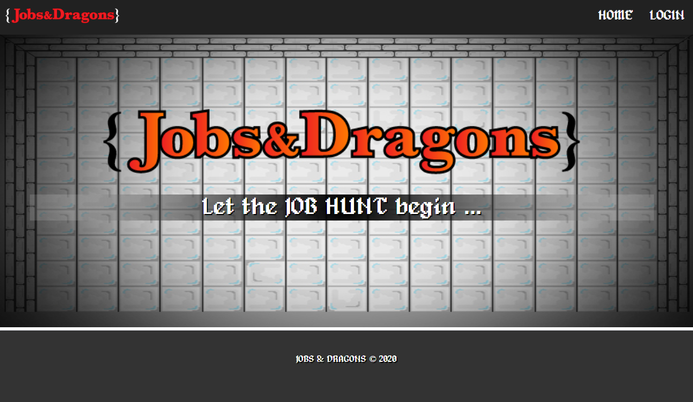

# Jobs & Dragons

## Introduction

Searching for a job in your field can be frustrating, repetitive, laborious, and boring. So why not make the process more fun? The Jobs & Dragons app was created to make the experience more engaging and fun for job searchers, new and experienced alike.

This web app runs on MongoDB, Express, React, and Node.js aka MERN.

[Website](https://jobs-and-dragons.herokuapp.com/)

## Usage

1. Visit the website and log into using your GitHub profile.
2. Complete your quests to build up your profile and resume.
3. Afterward, you can start searching for jobs that are relevant to your skills and qualifications.

## Preview

