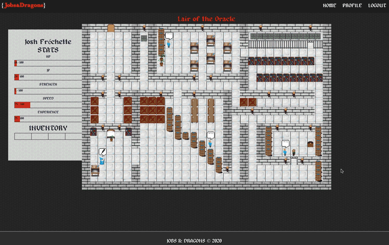

<h1 align="center">University of Toronto Full-Stack Web Developer Bootcamp Capstone Project</h1>

  

## Table of Contents

1. [Introduction](#introduction)
1. [Motivation](#motivation)
1. [User Stories](#user-stories)
1. [Requirements](#requirements)
1. [Getting Started](#getting-started)
1. [Built with](#built-with)
1. [Preview](#preview)
1. [Directions For Future Development](#directions-for-future-development)
1. [Meet the Team](#meet-the-team)

## Introduction

Searching for a job in your field can be frustrating, repetitive, laborious, and boring. So why not make the process more fun? The Jobs & Dragons app was created to make the experience more engaging and fun for job searchers, new and experienced alike.

Go to [Jobs & Dragons](https://jobs-and-dragons.herokuapp.com/)

Guest Login:
email - jobsanddragons@gmail.com
password - J&Dteam2020

## Motivation

Our Motivation in creating the Jobs&Dragons App was to create a platform that was more engaging and fun for job
searchers, new and experienced alike.

## User Stories

AS A job searcher
I WANT TO have an engaging experience
SO THAT I will feel more enthused about the process

AS A person ambitious about their career
I WANT TO improve my future job prospects
SO THAT I be ready for the next opportunity

## Requirements

- User can sign up through LinkedIn of GitHub
- Creates a profile through Linkedin or by uploading résumé
- Homepage aggregates job listings for the specified location and title preferences
- Jobs listed in cards
- The jobs that matches the most keywords in user’s profile or linkedin are highlighted or starred (application of search/sort)
- User can see the detail of the job post by extending the card
- Refused application can be archived for future review
- Customized cover letter and résumé can be checked for keywords and sentiment analysis using ML API

## Getting Started

1. Visit the website and log into using your GitHub profile.
2. Complete your quests to build up your profile and resume.
3. Afterward, you can start searching for jobs that are relevant to your skills and qualifications.

## Built with

- Front End CSS Framewwork: [MaterializeCSS](https://materializecss.com/)
- Front End Library/Framework: [React.js](https://reactjs.org/)
- Front End State Management: [React.js Context API](https://reactjs.org/docs/hooks-reference.html#usecontext)
- Backend Server: [Node.js](https://nodejs.org/en/)
- Server Side HTTP Framework: [Express.js](https://expressjs.com/)
- Database: [MongoDB](https://www.mongodb.com/)
- Database ORM: [Mongoose](https://mongoosejs.com/)
- Authentication/Authorization: [Auth0](http://auth0.com/)
- Job listing API: [Adzuna API](https://developer.adzuna.com/)
- User Info API: [Github API](https://developer.github.com/v3/)

## Preview

## Directions For Future Development

- Create more quests and develop the game environments more.
- Use it as a storyboard to showcase how we progressed through our Bootcamp journey
- Include quests geared towards practicing whiteboard interview questions.
- freeCodeCamp has a huge section for that. We can use our app to gamify their interview section and try to integrate it with their api. (Great for showing we contribute open source and also some publicity that might help with job search)

## Meet the Team

- [Anas Qazi](https://github.com/ianasqazi) worked on implementing authentication using auth0 and Job Listing api. Also in making the website mobile-responsive using google’s materialize css.
- [Anya Fareena](https://github.com/AnyaFareena) worked on the resume builder part of this project. Built react space where user is provided with form to enter details which in turns builds a resume with edit and download options
- [David Gehtman](https://github.com/davidgeht) worked on setting the Mongo Database, and creating the model schema. Also i worked on integrating the front end with the database.
- [Josh Fréchette](https://github.com/JoshFrechette) art direction and developing the gameplay of the app. Created mock-ups that determined the visual feel and flow of the app
- [Khalil Mouna](https://github.com/KhalilMouna) worked on frontend development as well as asset creation and helped create the overall look and feel of the app.
- [Sal Tamay](https://github.com/saltamay) implemented the Game Engine using React Hooks, and Context API. Designed and implemented how data (state) is managed within the app. Also, helped teammates when they get stuck with their parts.
- [Shaili Shah](https://github.com/sshaili) worked on the userinfo form for this project, Where user can enter their details that will help to match their profile for better job options.
- [Winson Quon](https://github.com/Winyumi) implemented the API controllers that access the database on the backend. Responsibilities also include overall code review, bug testing, Travis CI set up, Heroku deployment, and deployment testing.
